<p align="center">
  <a href="./README.md">🇨🇳 中文</a> &nbsp;|&nbsp; <a href="./README_EN.md">🌐 English</a>
</p>

<h1 align="center">AutoPulse：汽车销量预测与用户舆情分析</h1>

<p align="center">
  多源汽车数据 + 用户口碑舆情 + 销量预测与归因 → 一套端到端分析流水线与交互式网页看板
</p>

<video src="https://github.com/user-attachments/assets/6072ccda-0d16-4865-8937-c1c3b73eeaa5" width="900" controls></video>


---

## 项目简介

**AutoPulse** 是一套面向汽车行业的数据洞察项目，把“懂车帝用户口碑、车型配置参数、太平洋汽车月度销量”三类公开数据打通，回答三个核心问题：

1. **下个月能卖多少？** —— 用 ARIMA / Prophet / XGBoost / LSTM / 融合模型做销量预测。
2. **用户舆情真的影响销量吗？** —— 用大模型做 ABSA（Aspect-Based Sentiment Analysis）逐维度情感分析，再用 SHAP / Granger 因果量化影响。
3. **如何持续监控？** —— 把前五阶段结论封装成纯静态 HTML + ECharts 交互式网页看板，实现品牌→车系下钻、情感预警、归因可视化。

> 这是一个数据分析&开发作品集：从原始数据采集、清洗、建模、归因到最终交互看板，全部可复现。

---

## 在线看板

- 🌐 **在线演示**：https://yemyu.github.io/AutoPulse/
- 本地预览：`cd app && python -m http.server 8000`，浏览器打开 http://localhost:8000/

> 完整环境安装、本地运行与数据更新见下方「快速开始」。

---

## 六阶段工作流

项目按真实工作流拆成 6 个阶段，对应 `scripts/` 下 `01_` ~ `20_` 流水线脚本与 `notebook/AutoPulse_Analysis.ipynb`。

### 阶段一 · 数据准备

**问题**：如何把懂车帝（车型配置）、太平洋汽车（销量）、懂车帝口碑（舆情）三源数据对齐？

**方法**：
- 采集 `vehicles.csv`（1,139 车系 / 4,334 配置）、`sales.csv`（1,122 车系 / 33,845 条月度销量）、`sentiment_reviews.csv`（40,054 条口碑评论）。
- 用 `series_mapping.csv` 做跨平台 ID 桥接，三表统一为 `series_id`。
- 清洗 `vehicles.csv`：从 248 列去冗余至 92 列；保留“条件缺失”（如纯电动车无发动机参数）而非粗暴填零。

**结果**：三表对齐得到 `analysis_input.csv`（489 行），一行一车系，同时含销量、配置、舆情聚合。

<p align="center">
  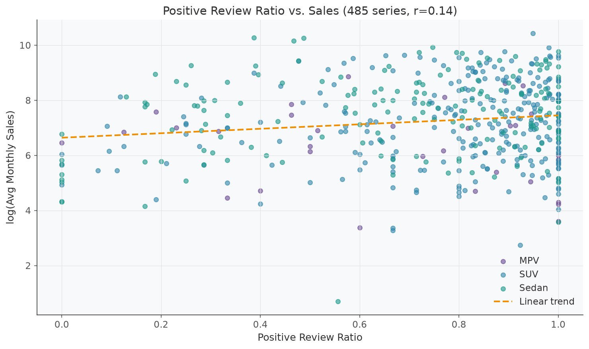
</p>

---

### 阶段二 · 数据筛选与探索性可视化

**问题**：哪些车系适合进入预测模型？整体市场长什么样？

**方法**：
- 筛选连续 ≥24 个月有销量的车系，得到 669 个稳定车系。
- 绘制全市场销量趋势、车型分类分布、价格/能源/续航/加速等硬件特征分布。

**结果**：
- 669 个车系进入后续建模，时间窗口质量更高。
- 识别出市场销量季节性、新能源占比、级别分布等宏观特征。

<p align="center">
  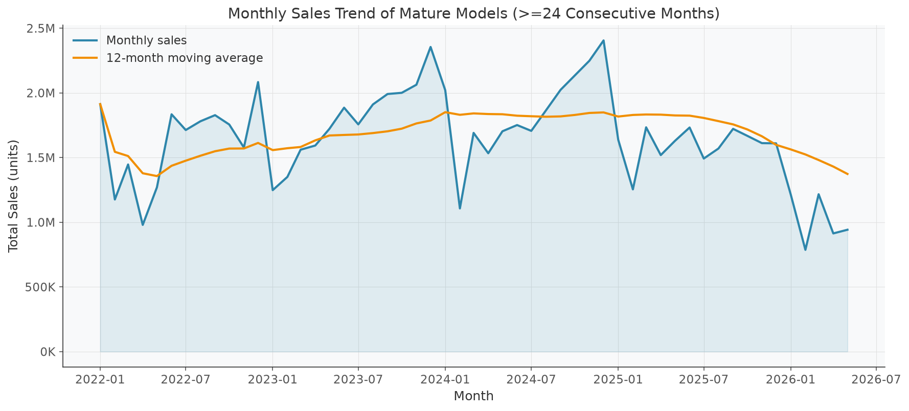
</p>

---

### 阶段三 · 销量预测建模

**问题**：多种时序模型中，谁能更稳健地预测月销量？外生变量有用吗？

**方法**：
- 在分层抽样的 150 车系代表集上，横向对比 ARIMA、Prophet、Prophet+外生、XGBoost、LSTM、Prophet+XGBoost 融合。
- 用 WMAPE（体积加权，抗长尾）+ 滚动交叉验证 + 特征消融 + 90% 预测区间。

**结果**：
- **XGBoost** 体积加权 WMAPE 最低（约 29.26%），Prophet+XGBoost 融合次之。
- 节假日、促销季、指导价等外生变量对月粒度预测贡献有限；历史销量滞后特征仍是主导。
- 误差随预测步长增长而扩大，符合直觉。

<p align="center">
  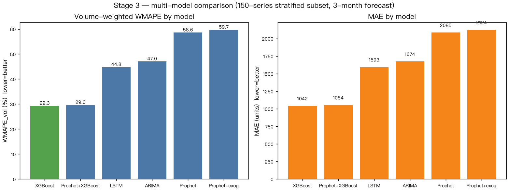
</p>

---

### 阶段四 · 用户舆情深度分析与销量归因

**问题**：用户口碑到底在谈什么？舆情对销量的贡献能量化吗？

**方法**：
- **深层 ABSA**：调用大模型（DeepSeek）对 28,724 条评论按外观、内饰、空间、动力、操控、舒适、油耗、配置、智能化、性价比 10 维度打分（-1/0/+1）。
- **销量归因**：把舆情特征加入车系级 XGBoost 销量模型，用 SHAP 解释各维度贡献。
- **Granger 因果**：在品牌级和全市场级检验“过去舆情 → 未来销量”的时序预测能力。

**结果**：
- 加入舆情特征后，系列级销量模型 R² 从 -0.073 提升至 0.138，MAPE 从 16.5% 降至 14.7%。
- SHAP 显示 **舒适 > 性价比 > 智能化** 是最影响销量的舆情维度。
- Granger 在品牌级约 10-15% 品牌显著，市场级不显著，符合汽车高单价、长决策周期的行业特点。

<p align="center">
  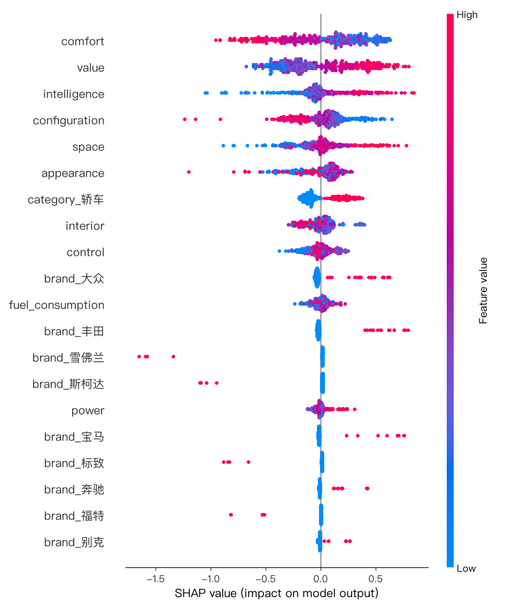
</p>

---

### 阶段五 · 舆情融合预测与话题预警

**问题**：把舆情动态加入销量预测模型，能不能提升精度？哪些话题需要预警？

**方法**：
- 对比“无情感 / Top3 情感 / 全量情感”三版 XGBoost 与 Prophet。
- 对舒适、性价比、智能化做 TF-IDF 关键词提取与 LDA 主题聚类。
- 定义规则：综合情感 < -0.1 且环比下降 > 0.05 时触发预警。

**结果**：
- 动态情感作为外生变量**未提升** volume-weighted 精度（XGBoost-baseline 34.79% vs +Top3sent 35.21%）。
- 但对尾部小销量车系，情感特征能降低 per-series WMAPE（327% → 311%）。
- 关键词 + LDA 主题可解释用户关注点；预警规则输出少量高优先级车系。

---

### 阶段六 · 交互式网页看板

**问题**：如何让非技术决策者也能按“问题 → 证据 → 结论”浏览全部成果？

**方法**：
- 用 **HTML + ECharts** 搭建 7 屏纯静态交互式看板：项目概览、销量预测、舆情 ABSA、销量归因、舆情↔销量关系、舆情预警、品牌/车型钻取。
- 数据由 `app/build_dashboard_data.py` 预烘焙为 `app/static/data/*.json`，前端直接 `fetch` 读取，无需任何后端服务。
- 支持中英双语切换；品牌/车型钻取支持 Tab 联动下钻。

**结果**：本地启动即可在浏览器中交互式查看全部分析结论，无需重新跑模型。

### 看板截图

<details>
  <summary><b>看板完整截图（点击展开）</b></summary>

<p align="center">
  点击任意图片可查看完整分辨率。
</p>

<table align="center">
  <tr>
    <td align="center" width="50%">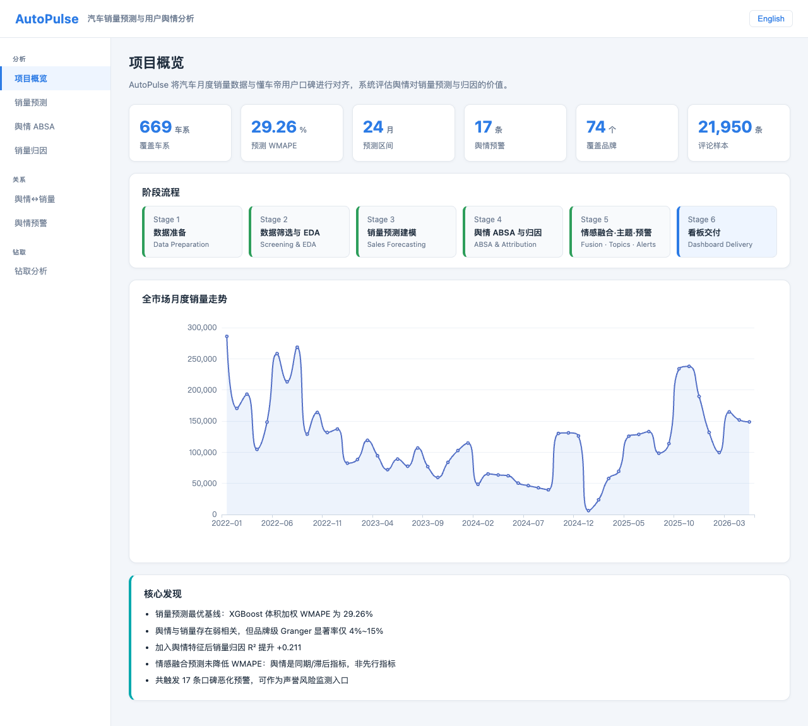</td>
    <td align="center" width="50%">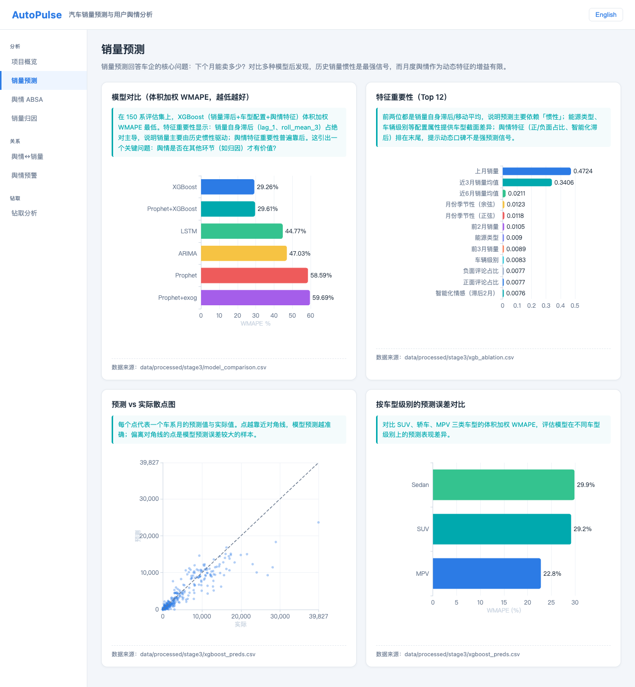</td>
  </tr>
  <tr>
    <td align="center">项目概览</td>
    <td align="center">销量预测</td>
  </tr>
  <tr>
    <td align="center" width="50%">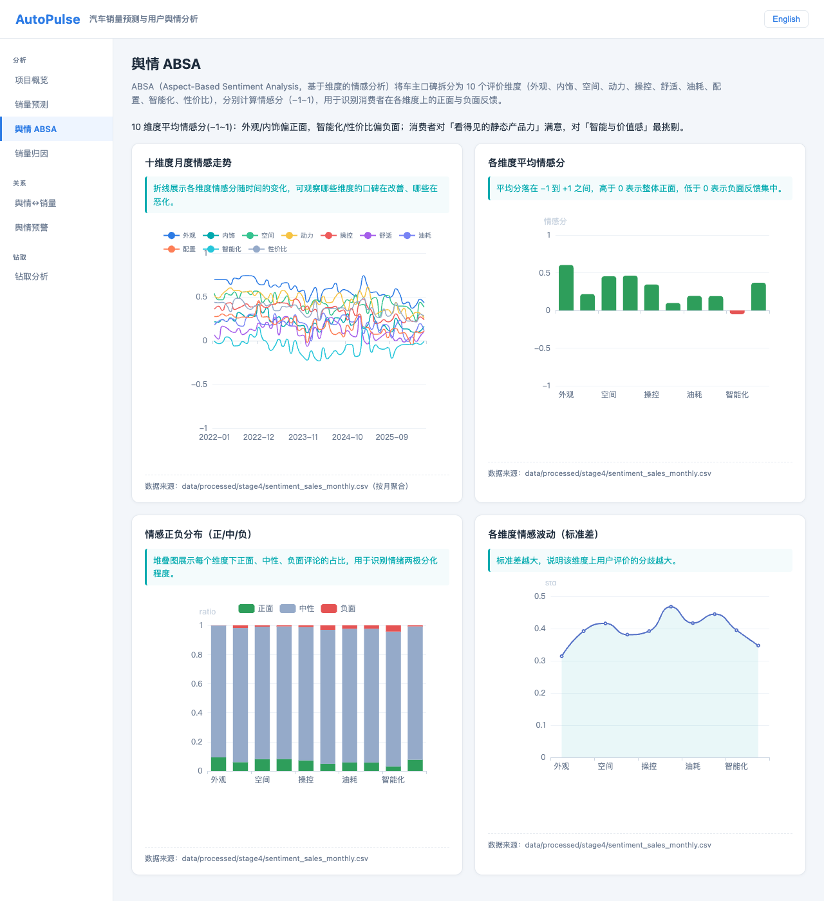</td>
    <td align="center" width="50%">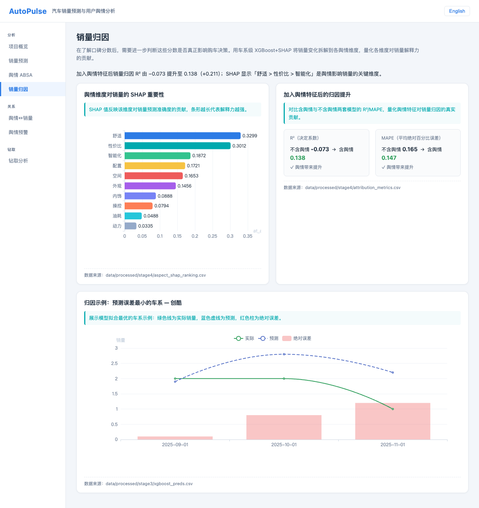</td>
  </tr>
  <tr>
    <td align="center">舆情 ABSA</td>
    <td align="center">销量归因</td>
  </tr>
  <tr>
    <td align="center" width="50%">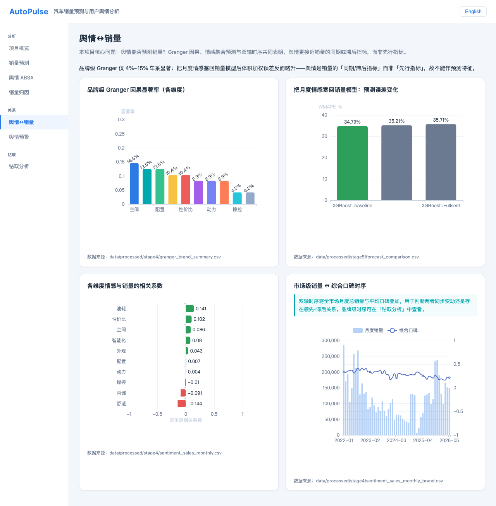</td>
    <td align="center" width="50%">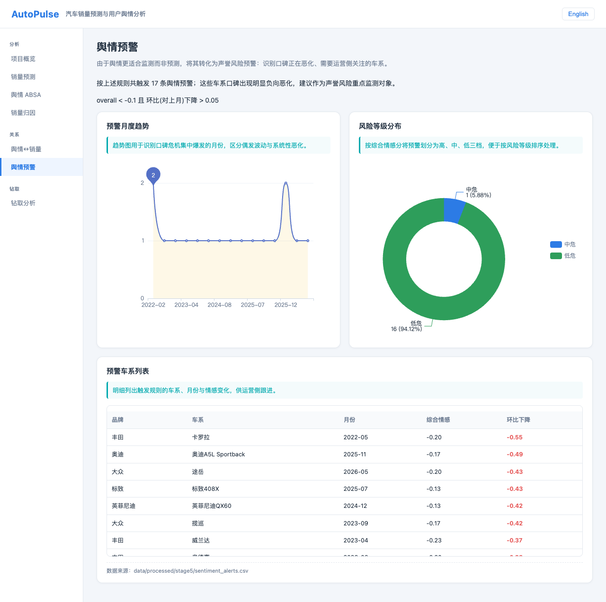</td>
  </tr>
  <tr>
    <td align="center">舆情↔销量关系</td>
    <td align="center">舆情预警</td>
  </tr>
  <tr>
    <td align="center" colspan="2">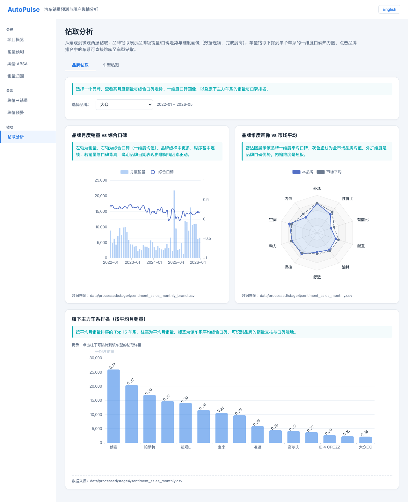</td>
  </tr>
  <tr>
    <td align="center" colspan="2">品牌/车型钻取</td>
  </tr>
</table>

</details>

---

## 快速开始

### 环境

依赖已整理在 `requirements.txt`，用你习惯的 Python 环境（venv / conda / 全局均可）安装即可：

```bash
pip install -r requirements.txt
```

### 启动网页看板（本地）

```bash
cd app && python -m http.server 8000
```

打开浏览器访问 http://localhost:8000/ 即可预览。（看板是纯静态站点，不依赖任何后端服务。）

### 在线看板

- 🌐 **在线演示**：https://yemyu.github.io/AutoPulse/
- 看板所需数据已预烘焙在 `app/static/data/*.json`，**无需重跑任何采集或建模脚本即可直接查看**。如需在本地更新数据桥（需已跑过完整管线、本地存在 `data/processed/*.csv`），运行：

```bash
python app/build_dashboard_data.py
```

---

## 目录结构

```
AutoPulse/
├── app/                           # 阶段六 · 纯静态网页看板（HTML + ECharts，GitHub Pages 部署）
│   ├── index.html / forecast.html / …  # 7 屏静态页面
│   ├── build_dashboard_data.py    # 预烘焙 JSON 数据桥
│   ├── .nojekyll                  # 禁用 GitHub Pages 的 Jekyll 处理
│   └── static/                    # CSS/JS/JSON 数据
├── data/                          # 数据目录（CSV 已 gitignore）
│   ├── README.md                  # 数据说明（中文）
│   ├── README_EN.md               # 数据说明（英文）
│   ├── raw/                       # vehicles.csv, sales.csv
│   ├── sentiment/                 # 口碑明细与汇总
│   └── processed/                 # 阶段产物（可复现）
├── figures/                       # 分析结果图、看板截图与交互演示（入库）
├── LICENSE                        # MIT 许可证
├── notebook/                      # 中英双语数据分析笔记本
│   ├── AutoPulse_Analysis.ipynb
│   └── AutoPulse_Analysis_EN.ipynb
├── scripts/                       # 01_~20_ 流水线脚本
├── config/                        # 配置与 .env 模板
├── requirements.txt               # Python 依赖
├── README.md                      # 本文件（中文）
└── README_EN.md                   # 英文版
```

---

## 技术栈

- **数据采集**：Python `requests` + `BeautifulSoup` / 懂车帝口碑 API
- **数据处理**：Pandas、NumPy、ETL Pipeline
- **NLP**：jieba、Hugging Face Transformers、DeepSeek API（ABSA）
- **机器学习 / 时序**：scikit-learn、XGBoost、 Prophet、statsmodels、PyTorch（LSTM）
- **可视化**：Matplotlib、ECharts（网页看板）
- **Web 看板**：原生 HTML/CSS/JS、ECharts 5（纯静态，GitHub Pages 托管）
- **依赖管理**：`requirements.txt`

---

## 数据说明

- 所有数据来自**公开汽车平台**（汽车之家、太平洋汽车等；用户舆情口碑另采集自懂车帝）。
- 原始 / 中间数据体积较大，已加入 `.gitignore`，克隆后按「快速开始」步骤即可直接启动看板。
- 数据版权归属原平台，本项目仅用于学习、研究与展示，不作商业用途。

详细数据字典、缺失值说明、质量报告见 `data/README.md`（含英文版 `data/README_EN.md`）。

---

## 致谢

- 数据来源于**懂车帝**（用户口碑、车型配置参数）与**太平洋汽车**（月度销量），感谢其公开数据支撑本项目的研究与展示。
- 数据版权归原平台所有，本项目仅用于学习、研究与展示，遵守其使用规范。

---

*License：MIT（仅对项目代码与文档；数据版权归原作者所有，请遵守原平台使用规范）。*
