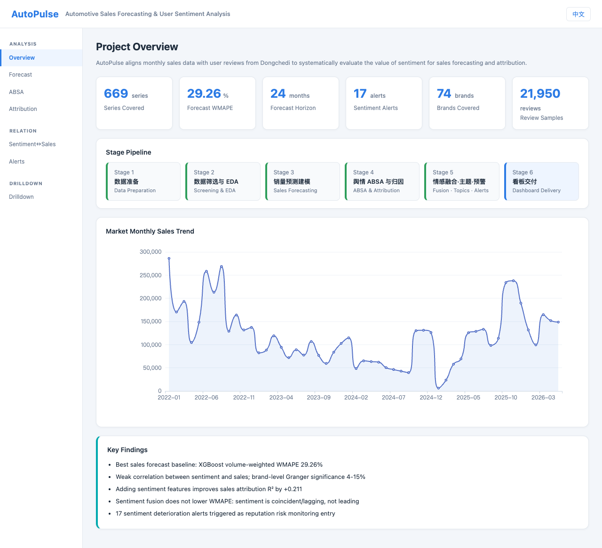
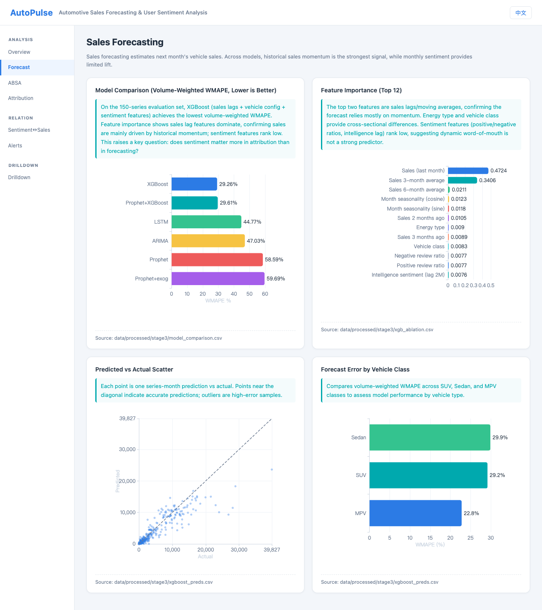
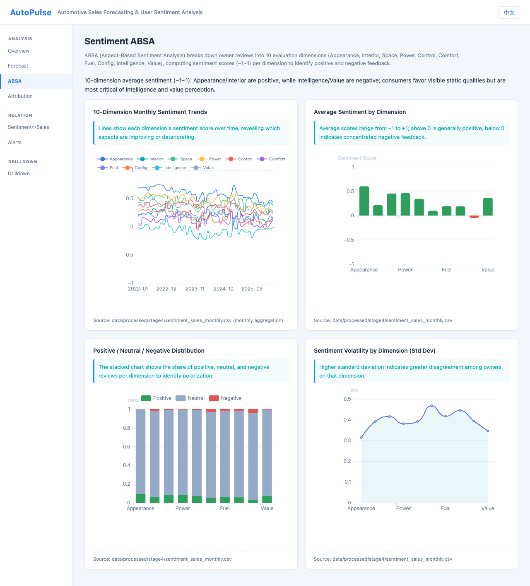
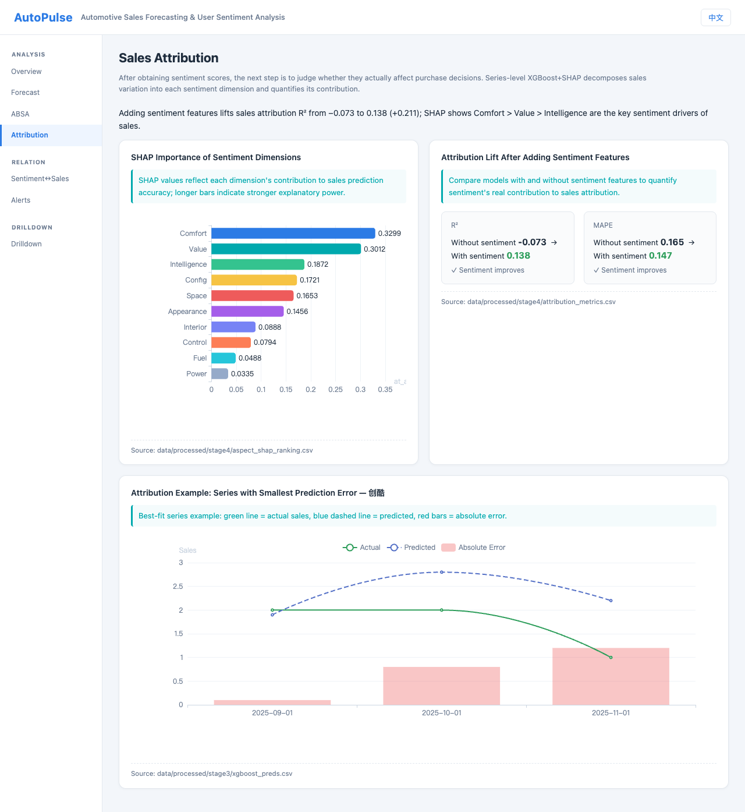
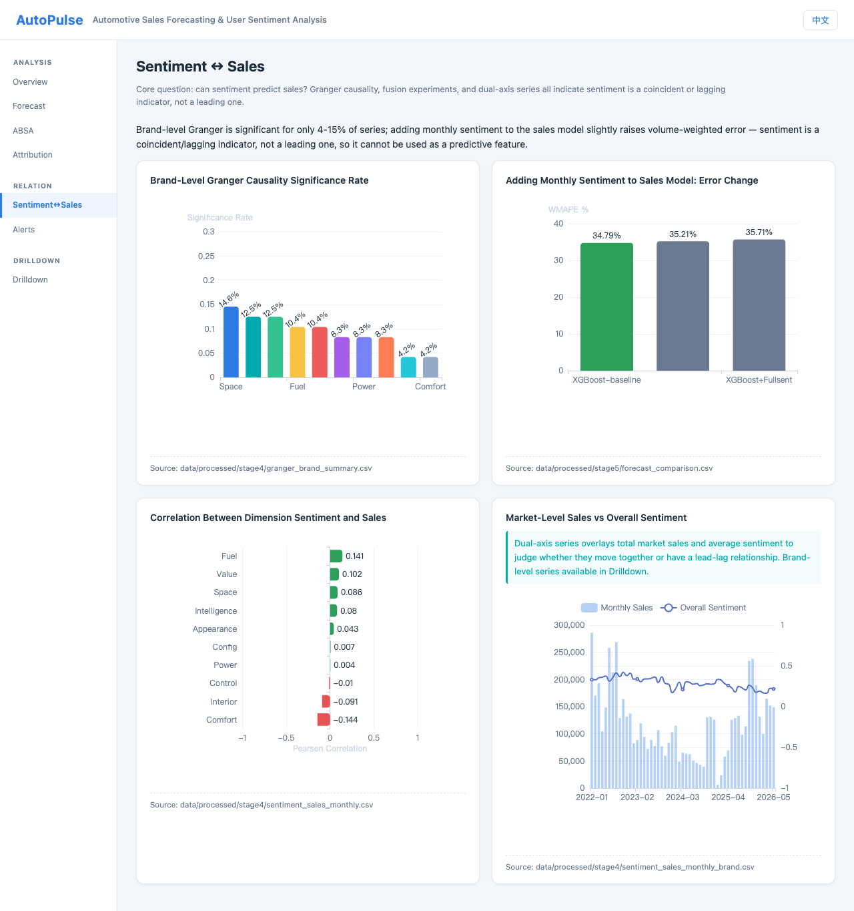
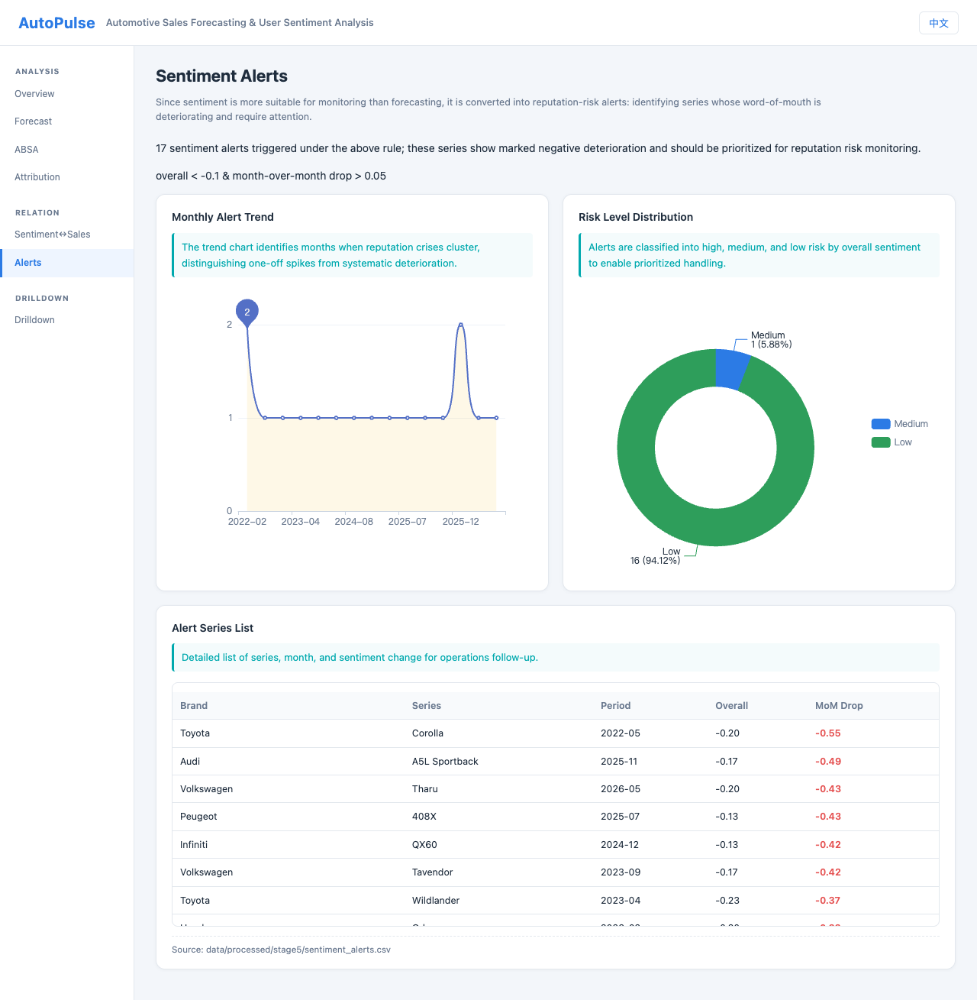
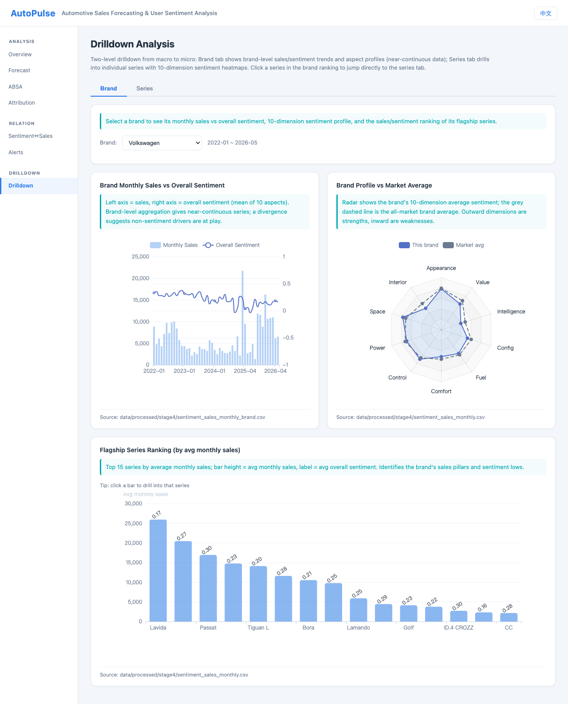

<p align="center">
  <a href="./README.md">🇨🇳 中文</a> &nbsp;|&nbsp; <a href="./README_EN.md">🌐 English</a>
</p>

<h1 align="center">AutoPulse: Automotive Sales Forecasting & User Sentiment Analysis</h1>

<p align="center">
  Multi-source automotive data + user word-of-mouth sentiment + sales forecasting & attribution →
  a end-to-end analytics pipeline and interactive web dashboard.
</p>
<video src="https://github.com/user-attachments/assets/977dd7cc-c016-4697-8468-beba9ce47ff1" width="900" controls></video>

---

## Project Overview

**AutoPulse** is an automotive data-insights project that connects three public data sources — **Dongchedi user reviews**, **vehicle specification parameters**, and **PCauto monthly sales** — to answer three core questions:

1. **How many cars will we sell next month?** — Sales forecasting with ARIMA / Prophet / XGBoost / LSTM / ensemble models.
2. **Does user sentiment really affect sales?** — Deep ABSA (Aspect-Based Sentiment Analysis) with a large language model, plus SHAP / Granger causality to quantify the impact.
3. **How do we monitor it continuously?** — Package all previous findings into a Flask + ECharts interactive web dashboard with brand → series drill-down, sentiment alerts, and attribution visualizations.

> This is a portfolio-grade data analysis project: from raw data collection, cleaning, modeling, attribution, and finally to an interactive dashboard, all reproducible from scripts.

---

## Six-Stage Workflow (Read like a Notebook)

The project is organized into six real-world stages, corresponding to the `01_` ~ `20_` pipeline scripts in `scripts/` and the `notebook/AutoPulse_Analysis_EN.ipynb`.

### Stage 1 · Data Preparation

**Question**: How do we align three heterogeneous sources — vehicle specs, sales, and user reviews?

**Approach**:
- Collect `vehicles.csv` (1,139 series / 4,334 trims), `sales.csv` (1,122 series / 33,845 monthly records), and `sentiment_reviews.csv` (40,054 reviews).
- Bridge cross-platform IDs with `series_mapping.csv` so all three tables share a single `series_id`.
- Clean `vehicles.csv`: reduce 248 raw columns to 92 meaningful features; keep "conditional missing" values (e.g., BEVs have no engine specs) instead of zero-filling.

**Result**: Three-table alignment yields `analysis_input.csv` (489 rows), one row per series with sales, specs, and sentiment aggregates.

<p align="center">
  
</p>

---

### Stage 2 · Data Filtering & Exploratory Visualization

**Question**: Which series are suitable for forecasting, and what does the overall market look like?

**Approach**:
- Filter series with at least 24 consecutive months of sales, giving 669 stable series.
- Visualize market sales trend, category distribution, and hardware features (price, energy type, range, acceleration).

**Result**:
- 669 series enter downstream modeling with higher time-window quality.
- Seasonality, EV share, and segment distribution are identified at the macro level.

<p align="center">
  
</p>

---

### Stage 3 · Sales Forecasting Modeling

**Question**: Among time-series models, which forecasts monthly sales most robustly? Are external regressors useful?

**Approach**:
- Compare ARIMA, Prophet, Prophet+exogenous, XGBoost, LSTM, and Prophet+XGBoost ensemble on a stratified 150-series evaluation set.
- Use WMAPE (volume-weighted, robust to long-tail), rolling cross-validation, feature ablation, and 90% prediction intervals.

**Result**:
- **XGBoost** has the lowest volume-weighted WMAPE (~29.26%), followed by the Prophet+XGBoost ensemble.
- Holidays, promotions, and guide price add little at monthly granularity; historical sales lag features dominate.
- Error grows with forecast horizon, as expected.

<p align="center">
  
</p>

---

### Stage 4 · Deep Sentiment Analytics & Sales Attribution

**Question**: What are users actually talking about? Can we quantify sentiment's contribution to sales?

**Approach**:
- **Deep ABSA**: Use the DeepSeek LLM to score 28,724 reviews across 10 aspects — appearance, interior, space, power, handling, comfort, fuel consumption, configuration, intelligence, and value (-1/0/+1).
- **Sales attribution**: Add sentiment features to a series-level XGBoost sales model and explain each aspect with SHAP.
- **Granger causality**: Test "past sentiment → future sales" at brand and market levels.

**Result**:
- Adding sentiment features lifts series-level R² from -0.073 to 0.138 and cuts MAPE from 16.5% to 14.7%.
- SHAP ranks **comfort > value > intelligence** as the most sales-relevant sentiment aspects.
- Granger is significant for ~10-15% of brands but not at the market aggregate, consistent with cars being high-ticket, long-consideration purchases.

<p align="center">
  
</p>

---

### Stage 5 · Sentiment Fusion Forecasting & Topic Alerts

**Question**: Does adding dynamic sentiment improve sales forecasting? Which topics need alerts?

**Approach**:
- Compare "no-sentiment / Top3-sentiment / full-sentiment" versions of XGBoost and Prophet.
- Extract TF-IDF keywords and run LDA topic clustering on comfort, value, and intelligence.
- Define an alert rule: overall sentiment < -0.1 and month-over-month drop > 0.05.

**Result**:
- Dynamic sentiment as an exogenous feature **does not improve** volume-weighted accuracy (XGBoost-baseline 34.79% vs +Top3sent 35.21%).
- For tail / low-volume series, sentiment reduces per-series WMAPE (327% → 311%).
- Keywords and LDA topics explain user concerns; the alert rule produces a small high-priority watch list.

---

### Stage 6 · Interactive Web Dashboard

**Question**: How can non-technical stakeholders browse all findings in a "problem → evidence → conclusion" narrative?

**Approach**:
- Build a **Flask + ECharts** 7-screen dashboard: Overview, Sales Forecasting, Sentiment ABSA, Attribution, Sentiment↔Sales Relation, Alerts, and Brand/Series Drill-down.
- Data is pre-baked into `app/static/data/*.json` by `app/build_dashboard_data.py`; the backend only renders templates.
- Supports Chinese/English switching; brand and series drill-down tabs are cross-linked.

**Result**: Launch locally and interactively explore all analysis conclusions in a browser, without re-running models.

### Dashboard Screenshots

<details>
  <summary><b>Full dashboard screenshots (click to expand)</b></summary>

<p align="center">
  Click any image to view it at full resolution.
</p>

<table align="center">
  <tr>
    <td align="center" width="50%"></td>
    <td align="center" width="50%"></td>
  </tr>
  <tr>
    <td align="center">Overview</td>
    <td align="center">Sales Forecast</td>
  </tr>
  <tr>
    <td align="center" width="50%"></td>
    <td align="center" width="50%"></td>
  </tr>
  <tr>
    <td align="center">Sentiment ABSA</td>
    <td align="center">Attribution</td>
  </tr>
  <tr>
    <td align="center" width="50%"></td>
    <td align="center" width="50%"></td>
  </tr>
  <tr>
    <td align="center">Sentiment↔Sales Relation</td>
    <td align="center">Alerts</td>
  </tr>
  <tr>
    <td align="center" colspan="2"></td>
  </tr>
  <tr>
    <td align="center" colspan="2">Brand/Series Drill-down</td>
  </tr>
</table>

</details>

---

## Quick Start

### Environment

Dependencies are listed in `requirements.txt`. Install them in any Python environment you prefer (venv, conda, or system-wide):

```bash
pip install -r requirements.txt
```

### Launch the web dashboard

```bash
python app/app.py
```

Open the browser at http://127.0.0.1:5001/.

The dashboard data is already pre-baked into `app/static/data/*.json`, so **no crawling or modeling scripts need to be run to view it**. To refresh the data bridge locally (requires having run the full pipeline, i.e. `data/processed/*.csv` present), run:

```bash
python app/build_dashboard_data.py
```

---

## Directory Structure

```
AutoPulse/
├── app/                           # Stage 6 · Web dashboard (Flask + ECharts)
│   ├── app.py                     # Dashboard entry point
│   ├── build_dashboard_data.py    # Pre-bake JSON data bridge
│   ├── static/                    # CSS/JS/JSON data
│   └── templates/                 # 7-screen HTML templates
├── data/                          # Data directory (CSVs gitignored)
│   ├── README.md                  # Data docs (Chinese)
│   ├── README_EN.md               # Data docs (English)
│   ├── raw/                       # vehicles.csv, sales.csv
│   ├── sentiment/                 # review details & aggregates
│   └── processed/                 # stage artifacts (reproducible)
├── figures/                       # Analysis charts, dashboard screenshots, and demo GIF
├── LICENSE                        # MIT license
├── notebook/                      # Bilingual analysis notebooks
│   ├── AutoPulse_Analysis_EN.ipynb
│   └── AutoPulse_Analysis_EN.ipynb
├── scripts/                       # 01_~20_ pipeline scripts
├── config/                        # Config & .env template
├── requirements.txt               # Python dependencies
├── README.md                      # This file (Chinese)
└── README_EN.md                   # English version
```

---

## Tech Stack

- **Data collection**: Python `requests` + `BeautifulSoup` / Dongchedi review API
- **Data processing**: Pandas, NumPy, ETL pipelines
- **NLP**: jieba, Hugging Face Transformers, DeepSeek API (ABSA)
- **Machine learning / time-series**: scikit-learn, XGBoost, Prophet, statsmodels, PyTorch (LSTM)
- **Visualization**: Matplotlib, ECharts (web dashboard)
- **Web dashboard**: Flask, Jinja2, vanilla JS, ECharts 5
- **Dependency management**: `requirements.txt`

---

## Data Notes

- All data come from **public automotive platforms** (Dongchedi, PCauto) and are collected by self-built crawlers. **No manual curation, no personal information, fully reproducible**.
- Raw / intermediate data is large and gitignored; follow the "Quick Start" steps to launch the dashboard directly after cloning.
- Data copyright belongs to the original platforms. This project is for learning, research, and demonstration only, not commercial use.

Detailed data dictionary, missing-value notes, and quality report are in `data/README.md` (with English version `data/README_EN.md`).

---

## References & Acknowledgments

This project is inspired by the Capgemini Big Data Insights team internship. Technology choices and visual design reference several excellent open-source "web dashboard / data visualization" projects (high Star, useful for tech selection and README layout):

| Project | Language | Focus | Stars (approx.) |
|---------|----------|-------|-----------------|
| [apache/superset](https://github.com/apache/superset) | Python / TS | Data exploration & visualization platform | 68k+ |
| [grafana/grafana](https://github.com/grafana/grafana) | Go / TS | Time-series monitoring & alerting dashboard | 65k+ |
| [streamlit/streamlit](https://github.com/streamlit/streamlit) | Python / TS | Turn Python scripts into data apps | 42k+ |
| [metabase/metabase](https://github.com/metabase/metabase) | Clojure / JS | BI platform for non-technical users | 39k+ |
| [getredash/redash](https://github.com/getredash/redash) | Python / JS | Query-result visualization | 28k+ |
| [glanceapp/glance](https://github.com/glanceapp/glance) | Go | Self-hosted personal dashboard | 28k+ |
| [plotly/dash](https://github.com/plotly/dash) | Python / React | Analytical web applications | 22k+ |
| [evidence-dev/evidence](https://github.com/evidence-dev/evidence) | JS | Write reports & dashboards with Markdown + SQL | 12k+ |

---

*License: MIT (applies to project code and documentation only; data copyright belongs to the original platforms, please comply with their terms of use).*
